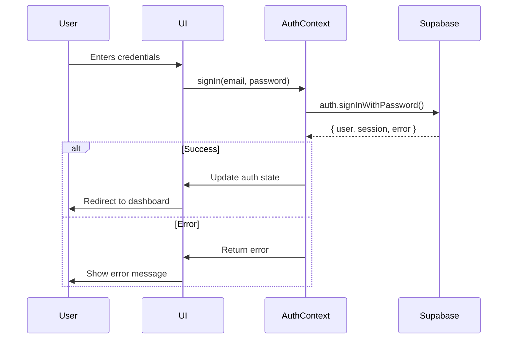

# Authentication & Authorization Guide

## Table of Contents
1. [Authentication Flow](#authentication-flow)
2. [Protecting Routes](#protecting-routes)
3. [User Roles](#user-roles)
4. [Session Management](#session-management)
5. [API Integration](#api-integration)

## Authentication Flow



## Protecting Routes

### Method 1: Using ProtectedRoute Component

```tsx
// routes.tsx
<Route 
  path="/protected" 
  element={
    <ProtectedRoute>
      <ProtectedComponent />
    </ProtectedRoute>
  } 
/>

// With role requirement
<Route 
  path="/admin" 
  element={
    <ProtectedRoute requiredRole="admin">
      <AdminDashboard />
    </ProtectedRoute>
  } 
/>
```

### Method 2: Using useRequireAuth Hook

```tsx
function ProtectedPage() {
  const { user, loading } = useRequireAuth('/login');
  
  if (loading) {
    return <LoadingSpinner />;
  }
  
  return <div>Protected Content</div>;
}
```

## User Roles

### Available Roles
- `client`: Regular user
- `lady`: Service provider
- `admin`: Administrator
- `advertiser`: Advertiser account

### Checking User Role

```tsx
const { user } = useAuth();

// Check if user has admin role
const isAdmin = user?.user_metadata?.role === 'admin';

// Check if user has any of multiple roles
const allowedRoles = ['admin', 'moderator'];
const hasAccess = allowedRoles.includes(user?.user_metadata?.role);
```

## Session Management

### Automatic Token Refresh
- Tokens are automatically refreshed 5 minutes before expiration
- On token refresh failure, user is automatically signed out
- Session state is synchronized across tabs

### Manual Session Refresh

```tsx
const { refreshSession } = useAuth();

const handleRefresh = async () => {
  const newSession = await refreshSession();
  if (!newSession) {
    // Handle refresh failure
  }
};
```

## API Integration

### Making Authenticated Requests

```tsx
const fetchProtectedData = async () => {
  const { data: { session } } = await supabase.auth.getSession();
  
  const response = await fetch('/api/protected-route', {
    headers: {
      'Authorization': `Bearer ${session?.access_token}`
    }
  });
  
  return response.json();
};
```

### Handling 401 Unauthorized

```tsx
import { supabase } from '../lib/supabase';

// In your API client or fetch wrapper
const fetchWithAuth = async (url: string, options: RequestInit = {}) => {
  const { data: { session } } = await supabase.auth.getSession();
  
  const response = await fetch(url, {
    ...options,
    headers: {
      ...options.headers,
      'Authorization': `Bearer ${session?.access_token}`
    }
  });

  if (response.status === 401) {
    // Token expired or invalid
    await supabase.auth.signOut();
    window.location.href = '/login';
    throw new Error('Session expired');
  }

  return response;
};
```

## Testing Authentication

### Mocking Auth in Tests

```tsx
// test-utils.tsx
import { AuthContext } from '../contexts/AuthContext';

export const mockAuth = {
  user: { 
    id: 'test-user-123',
    email: 'test@example.com',
    user_metadata: { role: 'client' }
  },
  session: {},
  loading: false,
  signIn: jest.fn(),
  signUp: jest.fn(),
  signOut: jest.fn(),
  resetPassword: jest.fn(),
  refreshSession: jest.fn()
};

export const renderWithAuth = (ui: React.ReactNode, auth = mockAuth) => {
  return render(
    <AuthContext.Provider value={auth}>
      {ui}
    </AuthContext.Provider>
  );
};
```

## Troubleshooting

### Common Issues

1. **Session not persisting**
   - Ensure `AuthProvider` wraps your entire app
   - Check Supabase client configuration

2. **Protected routes not redirecting**
   - Verify `AuthProvider` is above `BrowserRouter` in component tree
   - Check for any conflicting route definitions

3. **Role-based access not working**
   - Verify user's role in Supabase Auth metadata
   - Check role name casing (they are case-sensitive)

For additional help, refer to the [Supabase Auth Documentation](https://supabase.com/docs/guides/auth).
